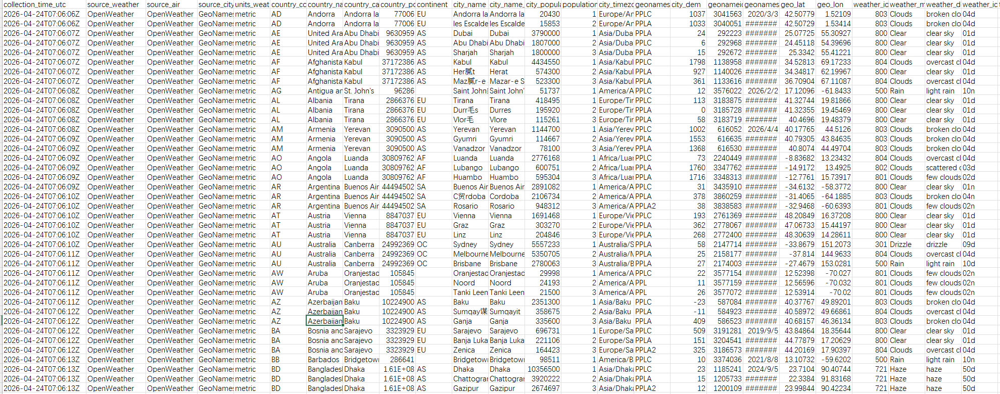
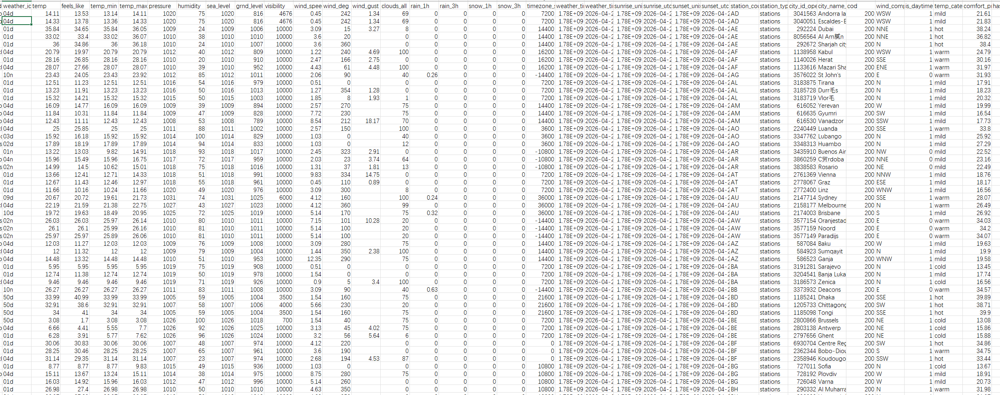
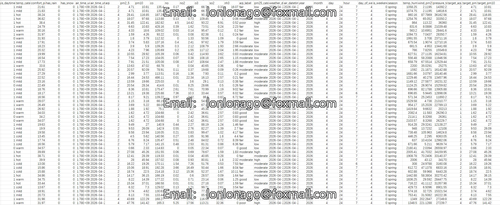
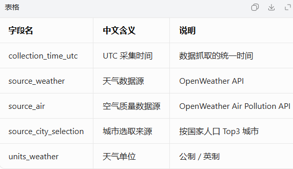
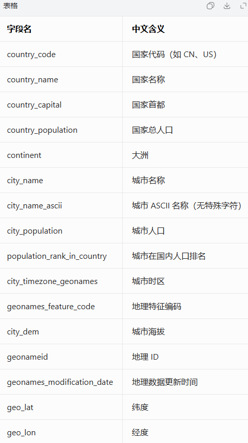
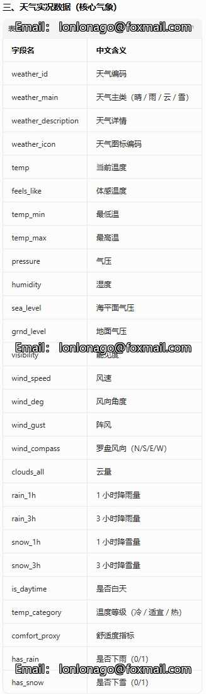
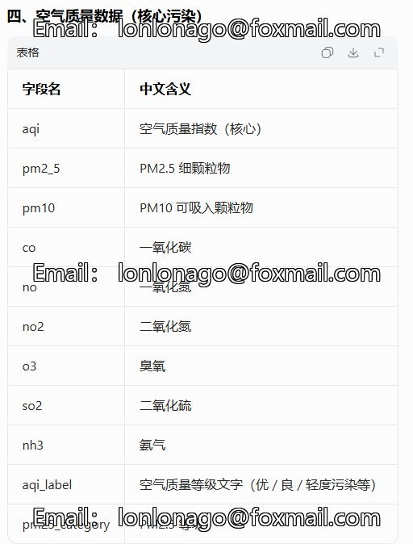

## Body

Global Weather and Air Pollution Data Set - April 24, 2026 to May 6, 2026

This dataset includes the current weather conditions and air pollution data for the top three cities with the highest population in each country. These data were filtered based on the city population from the GeoNames database.

- 15,000 City Data Set
- Number of Major Cities in Each Country: 3
- Minimum Population of the Cities Used for Source Data Filtering: 15000
- Generated Time: April 24, 2026 to May 6, 2026

For specific statistical fields, please refer to the product images.

## Images

Here is a pay link on Stripe ( https://buy.stripe.com/3cs8yP7sY87d0vu9AB ). Please contact me lonlonago@foxmail.com after funding $89, and I will send you a complete data files , thank you!

